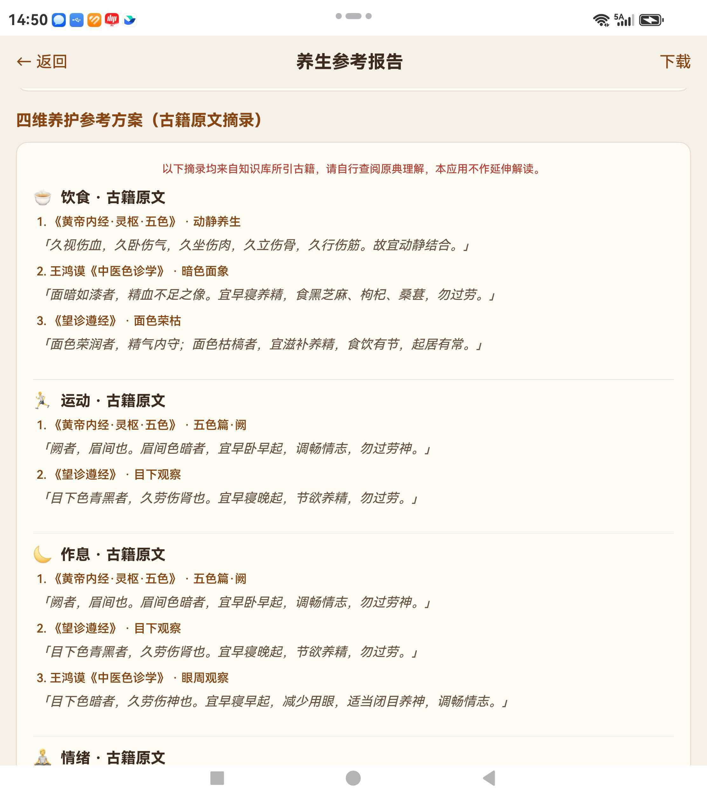
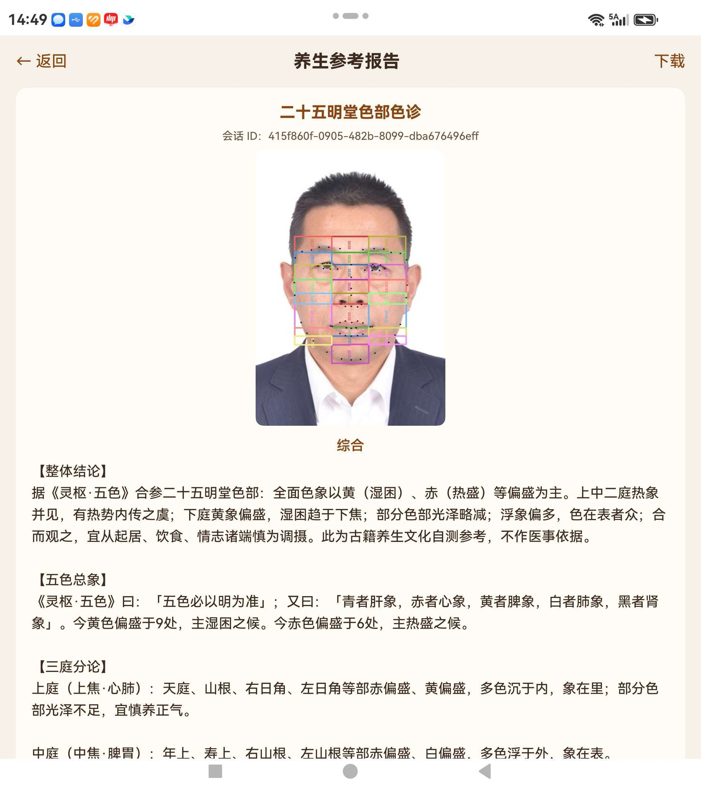
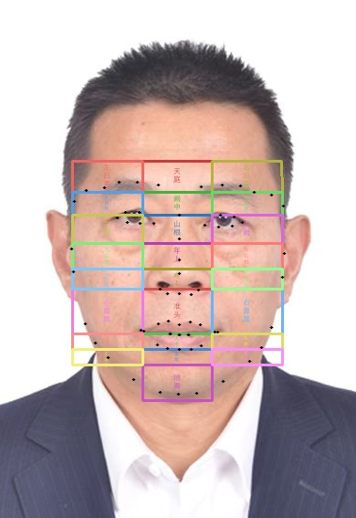
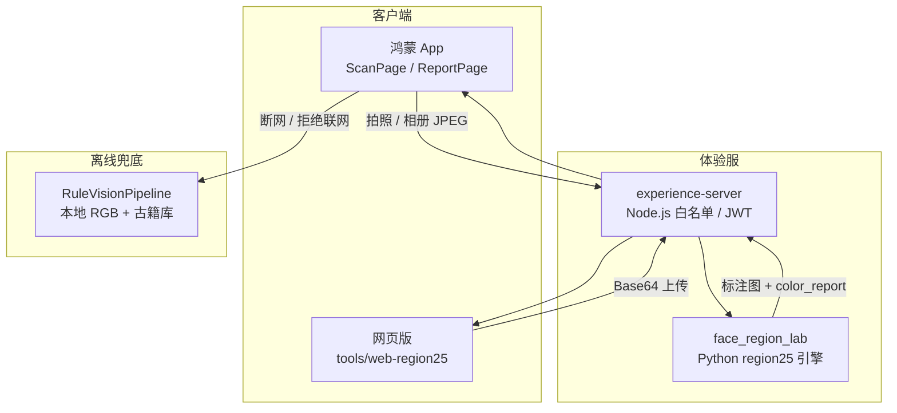

# 古籍面诊 · 二十五明堂色诊

<p align="center">
  <strong>拍一张正脸，读懂《灵枢·五色》里的古人养生智慧</strong><br/>
  鸿蒙原生 App · 网页即开即用 · 开源可自建
</p>

<p align="center">
  <a href="http://qhdhao.cn/sezhen/"><b>🌐 立即体验网页版</b></a>
  &nbsp;·&nbsp;
  <a href="#三步上手">📱 三步上手</a>
  &nbsp;·&nbsp;
  <a href="#效果预览">👀 看效果</a>
</p>

<p align="center">
  
  
  
  
  
</p>

---

## 一句话介绍

**face-diagnosis-app** 把两千年前的面诊色部理论，做成今天手机上就能用的养生文化自测工具：上传或拍摄正脸照片，自动划分 **25 个明堂色部**，生成带古籍出处的可读报告——不是冷冰冰的化验单，而是《灵枢·五色》体例下的**整体观察 + 三庭分论 + 四维养护建议**。

> 适合：对中医传统文化感兴趣的人 · 鸿蒙开发者找原生项目参考 · 研究者想复现 25 区 Lab 色诊流水线 · 养生类内容创作者寻找合规文案框架  
> ⚠️ **非医疗软件**：不提供诊断、处方或治疗建议，身体不适请就医。

---

## 你能得到什么？

| 你会看到 | 背后是什么 |
|----------|------------|
| 🎨 **脸上 25 块彩色标注区** | MediaPipe 68 点 + 《形色外诊简摩》九行三列网格，左右对称、相邻不重叠 |
| 📜 **古籍体例综合摘要** | 整体结论、五色总象、上中下三庭分论——**不堆砌 Lab 数字**，普通人也能读懂 |
| 🍵 **饮食 / 运动 / 作息 / 情绪** | 四维养护方案，每条附古籍原文出处，可溯源、可学习 |
| 📷 **拍照或相册上传都行** | 有拍摄距离、光线引导；不必当场自拍，相册里已有照片也能分析 |
| 🔒 **隐私与合规** | 联网需你同意；分析后本地删图；敏感词过滤；启动强制免责 |

**网页版免安装**：打开 [qhdhao.cn/sezhen](http://qhdhao.cn/sezhen/)，注册后即可上传照片体验（须白名单）。  
**鸿蒙 App**：DevEco 编译安装，体验更完整（取景框、变焦、元服务卡片）。

---

## 效果预览

### 鸿蒙 App · 真机报告（用户实拍）

<p align="center">
  
  &nbsp;&nbsp;
  
</p>

<p align="center"><sub>左：25 区标注 + 整体结论 / 五色总象 / 三庭分论 · 右：四维养护古籍原文摘录</sub></p>

### Python 实验室 · 标注流水线输出

<p align="center">
  
</p>

<p align="center"><sub>开源可复现：68 点 → 25 区几何 → Lab 色诊 → JSON 报告 + 标注图</sub></p>

---

<a id="三步上手"></a>

## 三步上手（最快 1 分钟）

### ① 想先玩玩 → 打开网页版

1. 访问 **[http://qhdhao.cn/sezhen/](http://qhdhao.cn/sezhen/)**
2. 输入手机号注册（需作者白名单）
3. 点 **「上传已有照片」** → **开始色诊分析** → 看报告

### ② 想用 App → 编译鸿蒙工程

DevEco Studio 5.0+ 打开本仓库 → 配置签名 → Run 到真机 → 设置里注册手机号 → 扫描页拍照或 **上传照片**

### ③ 想研究算法 → 跑 Python 实验室

```bash
cd tools/face_region_lab
python3 -m venv .venv && source .venv/bin/activate
pip install -r requirements.txt
python demo.py --image assets/test_face.png   # 生成 output/annotated.jpg
```

更多细节见下方 [快速开始](#快速开始详细) 章节。

---

## 为什么值得关注？（给个 Star 吧 ⭐）

- **文化 + 工程少见组合**：不是 PPT 概念，是 **App、网页、Python、体验服** 全链路跑通的开源仓库
- **报告能给人看**：古籍体例摘要 + 原文摘录，适合自媒体、社群、课程做**合规文化科普**（非医疗表述）
- **可二次开发**：模块化 ArkTS、独立 Python 引擎、静态网页 + 一键部署脚本，拿来改自己的场景
- **透明可审计**：25 区系数、规则、报告生成逻辑全部在仓库里，欢迎 Issue 讨论古籍引用是否准确

<p align="center">
  <strong>觉得有意思？点右上角 Star，让更多人看见传统色诊的数字化尝试 🙏</strong>
</p>

---

## 这是什么？（技术形态）

| 形态 | 说明 |
|------|------|
| **鸿蒙 App / 元服务** | 原生 ArkTS，现场拍照或相册上传，云端 25 色部分析 |
| **网页版** | 纯静态页 + REST API，手机 / 电脑均可上传正脸图 |
| **Python 实验室** | MediaPipe 68 点 + 25 区几何映射 + Lab 色诊 + 标注图导出 |
| **体验服** | Node.js 代理，白名单免 Key 体验（Key 仅放服务端） |

### 核心能力

- **25 色部 Lab 分析**：每区提取主色、浮沉光泽等，映射古籍条文
- **综合摘要**：整体结论、三庭观察、典籍提示——可读性优先
- **性别一致性校验**：68 点启发式 vs 用户设置，减少误用
- **拍摄引导**：最佳距离 40–60 cm、光线建议；支持相册上传
- **离线兜底**：断网 / 无 Key 时本地 RGB 规则 + 静态古籍库

---

## 系统架构



---

## 仓库结构

```
face-diagnosis-app/
├── entry/                      # 鸿蒙 App（ArkTS）
├── tools/face_region_lab/      # Python 25 区 + Lab 引擎
├── tools/experience-server/    # Node 体验服 API
├── tools/web-region25/         # 网页版 + 部署脚本
└── docs/screenshots/           # 真机截图
```

---

<a id="快速开始详细"></a>

## 快速开始（详细）

### 🌐 网页版本地部署

```bash
# 修改 tools/web-region25/config.js 中的 FACE_API_BASE
python3 -m http.server 8080 --directory tools/web-region25
```

一键部署到自有服务器：`./tools/web-region25/deploy-to-qhdhao.sh`

### 📱 鸿蒙 App

| 环境 | 要求 |
|------|------|
| IDE | DevEco Studio 5.0+ |
| SDK | HarmonyOS API 12 |
| 签名 | Project Structure → Signing Configs |

扫描页：**右上角上传照片** · **现场拍照** · 拍摄提示卡片 · 变焦滑条

体验服地址：`entry/src/main/ets/common/constants/AppConstants.ets`

### 🖥️ 自建体验服

```bash
cd tools/experience-server
npm install
export DASHSCOPE_API_KEY=你的通义Key
export WHITELIST=13800138000
npm start
```

---

## 技术栈

| 层级 | 技术 |
|------|------|
| 移动端 | ArkTS · CameraKit · PhotoViewPicker · ImageKit |
| 网页 | HTML / CSS / JS |
| 分析 | Python · MediaPipe · OpenCV Lab |
| 网关 | Node.js · JWT · CORS |
| AI（可选） | 通义千问 VL + Turbo |

---

## 古籍依据

- 《黄帝内经 · 灵枢 · 五色》
- 《望诊遵经》
- 王鸿谟《中医色诊学》
- 《形色外诊简摩》（25 区网格参考）

*均为现代整理本，仅供文化学习，不构成医疗依据。*

---

## 路线图

- [x] 25 色部 Python 流水线 + 标注图
- [x] 鸿蒙扫描页 + 相册上传 + 拍摄提示
- [x] 网页版上线 qhdhao.cn/sezhen
- [x] 古籍体例综合摘要 + 性别校验
- [ ] 端侧 .om 模型（代码保留）
- [ ] HTTPS 全站

---

## 参与与联系

| 你想… | 怎么做 |
|--------|--------|
| 试用 / 反馈 | [网页体验](http://qhdhao.cn/sezhen/) 或装 App，开 Issue |
| 改代码贡献 | Fork → PR，欢迎规则优化与文档改进 |
| **商用 / 定制 / 白名单** | **必须先联系作者书面授权** |
| 交个朋友 | 微信 `qhdhao` · 邮箱 qhdhao@126.com · GitHub [@qhdhao13](https://github.com/qhdhao13) |

---

## 许可与商用说明

本仓库代码、算法流程、报告体例及原创文案 **版权归作者 [@qhdhao13](https://github.com/qhdhao13) 所有**。

| 用途 | 是否允许 |
|------|----------|
| 个人学习、研究、非商用演示 | ✅ 欢迎，请 Star 支持 |
| _fork 后自用、改界面、接自己的 API_ | ✅ 请保留出处说明 |
| **商用**（含 App 上架收费、SaaS 收费、企业内训产品、自媒体带货转化等） | ❌ **未经作者书面同意，一律禁止** |
| 转载截图 / 介绍本项目 | ✅ 欢迎注明仓库链接 |

**商用授权、定制开发、私有化部署、白名单开通**，请联系：

- 微信：**qhdhao**
- 邮箱：**qhdhao@126.com**

未经授权的商用行为，作者保留追究法律责任的权利。

---

<p align="center">
  <strong>⭐ 好用、好看、有文化味——欢迎 Star，帮我们把古籍面诊数字化做得更好</strong>
</p>

<p align="center">
  <sub>古籍面诊 · 养生文化自测 · 非医疗 · 开源学习 · 商用需授权</sub>
</p>
