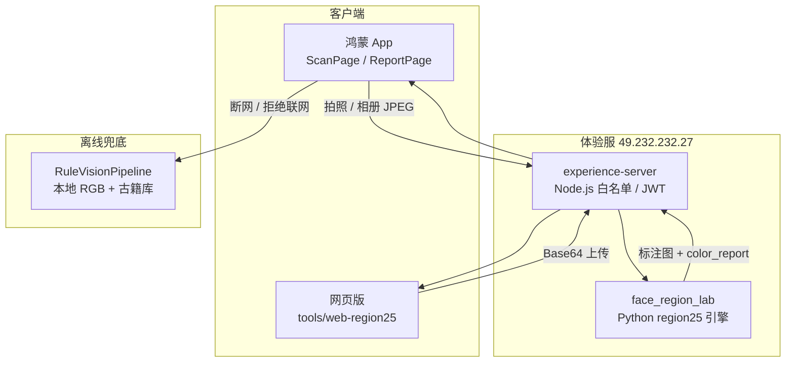

# 古籍面诊 · 二十五明堂色诊

<p align="center">
  <strong>把《灵枢·五色》搬进鸿蒙手机与浏览器</strong><br/>
  正脸拍照 / 相册上传 → 68 点人脸 → 25 色部 Lab 分析 → 古籍体例报告
</p>

<p align="center">
  <a href="http://qhdhao.cn/sezhen/">🌐 在线体验（网页版）</a> ·
  <a href="#快速开始">📱 鸿蒙 App 编译</a> ·
  <a href="#二十五色部标注实验室">🧪 Python 实验室</a>
</p>

<p align="center">
  
  
  
  
  
</p>

<p align="center">
  如果这个项目对你有启发，欢迎 ⭐ <strong>Star</strong>，让更多人看见传统色诊文化的数字化尝试。
</p>

---

## 这是什么？

**face-diagnosis-app** 是一套完整的「古籍面诊养生文化自测」开源方案，包含：

| 形态 | 说明 |
|------|------|
| **鸿蒙 App / 元服务** | 原生 ArkTS，现场拍照或相册上传，云端 25 色部分析 |
| **网页版** | 纯静态页 + REST API，手机 / 电脑均可上传正脸图 |
| **Python 实验室** | MediaPipe 68 点 + 25 区几何映射 + Lab 色诊 + 标注图导出 |
| **体验服** | Node.js 代理，白名单免 Key 体验（Key 仅放服务端） |

> ⚠️ **重要声明**：本仓库所有功能均为**传统文化趣味自测与养生参考**，**非医疗软件**，不提供诊断、治疗或用药建议。身体不适请及时就医。

---

## 效果预览

### 二十五色部标注（Python 实验室输出）

<p align="center">
  
</p>

<p align="center"><sub>依据《灵枢·五色》与《形色外诊简摩》划分的 25 个色部区域 · 仅供文化研究参考</sub></p>

### 核心能力一览

- **25 色部 Lab 分析**：每个区域提取 dominant Lab、浮沉光泽等特征，映射古籍条文
- **综合摘要**：整体结论、三庭观察、典籍提示——报告侧**不堆砌 Lab 数字**，可读性优先
- **性别一致性校验**：68 点几何启发式 vs 用户设置，减少误用
- **拍摄引导**：最佳距离（40–60 cm）、光线提示；支持**相册上传已有照片**
- **合规设计**：启动免责、联网授权、敏感词过滤、图像内存缓存用完即删
- **离线兜底**：断网 / 无 Key 时本地 RGB 规则引擎 + 静态古籍库

---

## 为什么值得 Star？

1. **少见的技术交叉**：HarmonyOS 原生 + 中医古籍数字化 + 计算机视觉，完整可跑通
2. **工程可复用**：模块化 ArkTS 架构、Python 标注流水线、静态网页部署脚本，均可单独借鉴
3. **开源透明**：25 区系数、Lab 规则、报告体例生成逻辑均可在仓库中查阅
4. **双端一致**：App 与网页共用同一体验服 API，行为对齐

---

## 系统架构



---

## 仓库结构

```
face-diagnosis-app/
├── entry/                      # 鸿蒙 App 主模块（ArkTS）
│   └── src/main/ets/
│       ├── pages/ScanPage.ets          # 扫描：取景框 / 变焦 / 拍摄提示 / 相册上传
│       ├── pages/ReportPage.ets        # 报告：25 色部 + 古籍综合摘要
│       ├── modules/vision/             # 视觉管线（云端 + 规则兜底）
│       └── modules/report/Region25ClassicalSummary.ets
├── tools/
│   ├── face_region_lab/        # Python：68 点 → 25 区 → Lab → 报告 JSON
│   ├── experience-server/      # Node.js：/v1/region25/analyze 等 API
│   └── web-region25/           # 网页版 + deploy-to-qhdhao.sh 一键部署
└── docs/                       # 端侧模型备选方案文档
```

---

## 快速开始

### 🌐 网页版（零安装体验）

1. 打开 **[http://qhdhao.cn/sezhen/](http://qhdhao.cn/sezhen/)**
2. 注册手机号（须管理员白名单）
3. 点击 **「上传已有照片」** 选择正脸图 → **开始色诊分析**

本地部署静态页：

```bash
# 将 tools/web-region25/ 放到任意 Web 根目录
# 修改 config.js 中的 FACE_API_BASE 指向你的体验服
python3 -m http.server 8080 --directory tools/web-region25
```

一键部署到 qhdhao.cn（需 SSH）：

```bash
./tools/web-region25/deploy-to-qhdhao.sh
```

---

### 📱 鸿蒙 App

**环境要求**：DevEco Studio 5.0+ · HarmonyOS API 12 (5.0.0) · 真机或模拟器

1. 用 DevEco Studio 打开项目根目录
2. **File → Project Structure → Signing Configs** 配置签名
3. 连接设备，点击 **Run** 编译安装
4. **设置** 中注册手机号；体验模式连接体验服，或填写自有 DashScope Key

**扫描页操作**：

| 入口 | 功能 |
|------|------|
| 右上角 **上传照片** | 从相册选择已拍好的正脸图 |
| **现场拍照** | 使用取景框 + 变焦滑条实时拍摄 |
| 拍摄提示卡片 | 最佳距离 40–60 cm、光线建议 |

体验服地址在 `entry/src/main/ets/common/constants/AppConstants.ets` 的 `ExperienceServerConfig.BASE_URL` 中配置。

---

### 🧪 二十五色部标注实验室

在 **不改 App** 的前提下，验证 25 区几何划分与 Lab 色诊：

```bash
cd tools/face_region_lab
python3 -m venv .venv && source .venv/bin/activate
pip install -r requirements.txt

# 校验 25 区配置
python validate.py

# 对单张照片生成标注图与 JSON
python demo.py --image assets/test_face.png
# → output/annotated.jpg
# → output/regions_pixel.json
# → output/color_report.json
```

详见 [tools/face_region_lab/README.md](tools/face_region_lab/README.md)。

---

### 🖥️ 自建体验服（免 App 内嵌 Key）

```bash
cd tools/experience-server
npm install
export DASHSCOPE_API_KEY=你的通义Key
export WHITELIST=13800138000,13900139000   # 11 位手机号，逗号分隔
npm start   # 默认 :8787
```

Python 分析服务需另行启动（见 `tools/face_region_lab/api_server.py` 与 `start-with-region25.sh`）。

---

## 技术栈

| 层级 | 技术 |
|------|------|
| 移动端 | ArkTS · CameraKit · PhotoViewPicker · ImageKit |
| 网页 | 原生 HTML / CSS / JS，无框架依赖 |
| 分析 | Python · MediaPipe Face Landmarker · OpenCV Lab |
| 网关 | Node.js · JWT 白名单 · CORS |
| AI（可选） | 通义千问 VL + Turbo（用户自备 Key 或体验服代持） |

---

## 模块化设计（App）

App 采用 **8 大解耦模块**，通过 `ModuleRegistry` 注册，便于替换与测试：

| # | 模块 | 职责 |
|---|------|------|
| 1 | permission | 相机 / 网络动态授权 |
| 2 | camera | 前置预览、拍照、内存缓存 |
| 3 | vision | 云端 25 色部 + 本地规则兜底 |
| 4 | knowledge | 《灵枢·五色》等静态古籍库 |
| 5 | wellness | 饮食 / 运动 / 作息 / 情绪四维方案 |
| 6 | report | 报告渲染与古籍溯源 |
| 7 | compliance | 免责、联网授权、敏感词 |
| 8 | settings | 用户信息、模型配置、版本 |

---

## 古籍依据

本项目的文化内容主要参考（**现代整理本，仅供学习**）：

- 《黄帝内经 · 灵枢 · 五色》
- 《望诊遵经》
- 王鸿谟《中医色诊学》
- 《形色外诊简摩》（25 区网格布局参考）

---

## 路线图

- [x] 25 色部 Python 流水线 + 标注图
- [x] 鸿蒙扫描页：固定椭圆框、变焦、拍摄提示、相册上传
- [x] 网页版 qhdhao.cn/sezhen 上线
- [x] 古籍体例综合摘要（App + Python 同步）
- [x] 68 点性别启发式校验
- [ ] 端侧 .om 模型推理（代码保留，非主路径）
- [ ] HTTPS 全站与小程序形态探索

---

## 参与与反馈

- **Star** 本项目，支持传统文化 + 原生开发的探索
- **Issue**：Bug、文案建议、古籍引用讨论
- **PR**：欢迎 Python 规则优化、UI 改进、文档翻译（英 / 日）

联系开发者：

- GitHub：[@qhdhao13](https://github.com/qhdhao13)
- 微信：qhdhao
- 邮箱：qhdhao@126.com

---

## 许可证

本仓库代码与原创文案版权归作者所有。**禁止未经授权商业使用。**

如需商用授权或定制部署，请通过上述方式联系。

---

<p align="center">
  <strong>⭐ 如果这个项目对你有帮助，请给一个 Star，谢谢！</strong>
</p>

<p align="center">
  <sub>古籍面诊 · 养生文化自测 · 非医疗 · 开源学习</sub>
</p>
